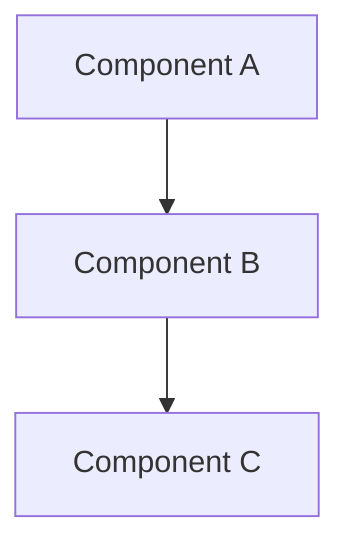

# Implementation Spec: [Feature Name]

> **Template Purpose**: This template is for creating Implementation Specs at the Child Repo level (DiasAdminUI, DiasRestApi, DiasDalApi). Use this template when implementing a feature within a single repository, whether as part of a Master Spec or as a standalone implementation.

## Metadata

- **Repository**: [DiasAdminUI | DiasRestApi | DiasDalApi]
- **Created**: [YYYY-MM-DD]
- **Status**: [active | in-progress | completed]
- **Master Spec**: [Link to Master Spec if this is part of cross-repo coordination, or "N/A" for standalone]
- **Related Specs**: [Links to related Implementation Specs in this or other repos]
- **Owner**: [Team/Person responsible]

## Overview

[Provide a clear description of what will be implemented in this repository. If this is part of a Master Spec, explain how this implementation contributes to the overall feature.]

## Requirements

[Define the specific requirements for this implementation. Use EARS (Easy Approach to Requirements Syntax) patterns where applicable.]

### Functional Requirements

1. [Requirement 1]
2. [Requirement 2]
3. [Requirement 3]

### Technical Requirements

1. [Technical constraint 1]
2. [Technical constraint 2]
3. [Technical constraint 3]

### Integration Requirements

[If this implementation needs to integrate with other services]

1. [Integration requirement 1]
2. [Integration requirement 2]

## Design

### Component Architecture

[Describe the components that will be created or modified]



### File Structure

[Outline the file structure for this implementation]

```
src/
├── components/
│   └── [new-component]/
│       ├── index.ts
│       ├── [component].ts
│       └── [component].test.ts
├── services/
│   └── [new-service].service.ts
└── models/
    └── [new-model].model.ts
```

### Data Models

[Define any new or modified data models]

```typescript
interface ExampleModel {
  id: string;
  name: string;
  createdAt: Date;
  updatedAt: Date;
}
```

### API Contracts

[Define any new or modified API endpoints]

#### Endpoint: [Method] /api/path

**Request**:
```json
{
  "field": "value"
}
```

**Response**:
```json
{
  "result": "value"
}
```

**Status Codes**:
- 200: Success
- 400: Bad Request
- 500: Internal Server Error

### Service Interfaces

[Define interfaces for services]

```typescript
interface ExampleService {
  getById(id: string): Promise<ExampleModel>;
  create(data: CreateExampleRequest): Promise<ExampleModel>;
  update(id: string, data: UpdateExampleRequest): Promise<ExampleModel>;
  delete(id: string): Promise<void>;
}
```

### External Dependencies

[List any external services or APIs this implementation depends on]

1. **Service Name**: [Description of dependency]
   - Endpoint: [URL or path]
   - Purpose: [Why it's needed]

## Code Quality Standards

### ESLint Compliance

All code in this implementation must follow the project's ESLint configuration:

**Required Standards:**
- ✅ **Zero ESLint Errors**: All errors must be resolved before merge
- ✅ **Explicit Return Types**: All functions must have return type annotations
- ✅ **Absolute Imports**: Use `@core/`, `@modules/`, `@dal/` instead of relative imports
- ✅ **Function Length**: Maximum 200 lines per function
- ✅ **Naming Conventions**: camelCase for variables/functions, PascalCase for classes/interfaces
- ✅ **Nullish Coalescing**: Use `??` instead of `||` for null/undefined checks

**Code Examples:**

```typescript
// ✅ CORRECT: Absolute imports with proper typing
import { LoggingService } from '@core/logging/logging.service';
import { UserModel } from '@modules/user/models/user.model';

// ✅ CORRECT: Explicit return types and proper naming
export class ExampleService {
  constructor(
    private readonly loggingService: LoggingService,
  ) {}

  async getUserById(userId: string): Promise<UserModel | null> {
    const user = await this.userRepository.findById(userId);
    return user ?? null; // ✅ Nullish coalescing
  }

  private validateUserData(userData: CreateUserRequest): ValidationResult {
    // ✅ Function under 200 lines with single responsibility
    return this.validator.validate(userData);
  }
}

// ✅ CORRECT: Interface with proper naming
interface CreateUserRequest {
  firstName: string;
  lastName: string;
  email: string;
}
```

**Quality Gates:**
- [ ] `npm run lint` passes with zero errors
- [ ] `npm run build` compiles successfully
- [ ] All functions have explicit return types
- [ ] No relative imports exceeding one level
- [ ] All functions under 200 lines

## Implementation Tasks

[Break down the implementation into specific, actionable tasks. Each task should be focused and testable.]

> **Test Task Marking**: Mark test tasks as optional using `*` suffix when appropriate:
> - **Core functional tests**: No `*` suffix - these validate correctness and should always run
> - **Performance tests**: Add `*` suffix - these are optional and run before merging
> - **Complex integration tests**: Add `*` suffix - these are optional and run before merging
> - **Property-based tests**: Core properties (no `*`), performance properties (`*` suffix)

### Task 1: [Task Name]

**Description**: [What needs to be done]

**Files to Create/Modify**:
- `path/to/file1.ts`
- `path/to/file2.ts`

**Acceptance Criteria**:
- [ ] [Criterion 1]
- [ ] [Criterion 2]

**Testing** (Core Suite):
- [ ] Unit tests written for core functionality
- [ ] Acceptance tests written for critical features

### Task 2: [Task Name]

**Description**: [What needs to be done]

**Files to Create/Modify**:
- `path/to/file1.ts`
- `path/to/file2.ts`

**Acceptance Criteria**:
- [ ] [Criterion 1]
- [ ] [Criterion 2]

**Testing** (Core Suite):
- [ ] Unit tests written
- [ ] Integration tests written (if essential)
- [ ] `TEST_INSTRUCTIONS.md` created (for bug fixes and feature requests)

**Testing** (Optional Suite):
- [ ]* Performance tests written
- [ ]* Complex integration tests written

### Task 3: [Task Name]

**Description**: [What needs to be done]

**Files to Create/Modify**:
- `path/to/file1.ts`
- `path/to/file2.ts`

**Acceptance Criteria**:
- [ ] [Criterion 1]
- [ ] [Criterion 2]

**Testing** (Core Suite):
- [ ] Property-based tests for functional invariants

**Testing** (Optional Suite):
- [ ]* Property-based tests for performance characteristics
- [ ]* Load and stress tests

## Testing Strategy

> **Testing Guidelines**: Follow the testing guidelines in `DiasRestApi/.kiro/steering/testing-guidelines.md` for test organization and execution.

### Test Categorization

Tests should be categorized as **core** or **optional**:

**Core Tests** (Fast feedback, < 2 minutes):
- Unit tests for functional correctness
- Acceptance tests for critical features
- Core property-based tests (functional invariants)
- Essential integration tests

**Optional Tests** (Comprehensive validation, 5-15 minutes):
- Performance tests with environment-specific thresholds
- Complex integration tests
- Optional property-based tests (performance, edge cases)
- Load and stress tests

### Unit Tests

[Describe unit testing approach]

**Test Files** (Core Suite):
- `path/to/test1.test.ts` - [Description]
- `path/to/test2.test.ts` - [Description]

**Coverage Requirements**: [e.g., 80% code coverage for core functionality]

**Test Focus**:
- Focus on functional correctness
- Test individual functions and classes
- Mock external dependencies
- Keep tests fast (< 100ms per test)

### Acceptance Tests

[Describe acceptance testing approach]

**Test Files** (Core Suite):
- `path/to/feature.acceptance.test.ts` - [Description]

**Test Scenarios**:
1. [Scenario 1] - Validates requirement [X.Y]
2. [Scenario 2] - Validates requirement [X.Z]

### Property-Based Tests

[Describe property-based testing approach if applicable]

**Core Property Tests**:
- `path/to/property.test.ts` - [Description of universal property]
  - **Property**: [Description of invariant being tested]
  - **Validates**: Requirements [X.Y]

**Optional Property Tests**:
- `path/to/performance-property.test.ts` - [Description]
  - **Property**: [Description of performance characteristic]
  - **Validates**: Requirements [X.Z]

**Configuration**:
- Default: 100 runs with minimal output
- Debugging: Use `PBT_VERBOSE=true` to see all iterations
- Thorough: Use `PBT_RUNS=1000` for comprehensive testing

### Integration Tests

[Describe integration testing approach]

**Core Integration Tests**:
- `path/to/integration.test.ts` - [Description of essential integration]

**Optional Integration Tests**:
- `path/to/complex-integration.test.ts` - [Description of complex scenario]

**Test Scenarios**:
1. [Scenario 1] - Core integration test
2. [Scenario 2] - Optional complex scenario

**Setup Requirements**:
- Use `IntegrationTestEnvironment` for service registration
- Register services explicitly in test setup
- Clean up services in test teardown
- Avoid relying on global state

### Performance Tests

[Describe performance testing approach if applicable]

**Performance Test Files** (Optional Suite):
- `path/to/performance.test.ts` - [Description]

**Performance Metrics**:
- Response time: [threshold]
- Throughput: [threshold]
- Memory usage: [threshold]

**Threshold Management**:
- Use `PerformanceThresholdManager` for environment-specific thresholds
- CI environment: Relaxed thresholds (2x local)
- Local development: Standard thresholds
- Production validation: Strict thresholds (0.5x local)

### Manual Testing

> **Required Deliverable**: For bug fixes and feature requests, create a `TEST_INSTRUCTIONS.md` document that provides step-by-step manual testing instructions. This document should be created as part of the testing task and placed in the spec folder (e.g., `.kiro/specs/{feature-name}/TEST_INSTRUCTIONS.md`).

**TEST_INSTRUCTIONS.md Requirements**:
- Prerequisites (environment setup, tools needed, authentication)
- Quick Start section (if Postman collection is included)
- Detailed test scenarios with step-by-step instructions
- Expected results for each scenario
- Verification checklists
- Troubleshooting section for common issues
- Success criteria

**Optional: Postman Collection** (for API endpoint testing):
- Create `{feature-name}.postman_collection.json` in the spec folder
- Include pre-configured requests for all test scenarios
- Add collection-level variables (baseUrl, tokens, etc.)
- Include test scripts for automatic response validation
- Add detailed descriptions with expected outcomes
- Reference the collection in TEST_INSTRUCTIONS.md Quick Start section

**Test Cases**:
1. [Test case 1]
2. [Test case 2]

**Example Structure**:
```markdown
# Manual Testing Instructions: [Feature Name]

## Quick Start with Postman Collection (Optional)

**Import Collection**:
1. Open Postman
2. Click "Import" → Select file: `.kiro/specs/{feature-name}/{feature-name}.postman_collection.json`
3. Configure variables (baseUrl, tokens, etc.)
4. Run requests and verify results

## Prerequisites
- [Tool/environment requirement 1]
- [Tool/environment requirement 2]

## Test Scenarios

### Scenario 1: [Name]
**Steps**:
1. [Step 1]
2. [Step 2]

**Expected Result**: [What should happen]

**Verification**: 
- [ ] [Check 1]
- [ ] [Check 2]

## Troubleshooting
- **Issue**: [Common problem]
  **Solution**: [How to fix]

## Success Criteria
- [ ] All scenarios pass
- [ ] No errors in logs
```

### Test Execution

**During Development** (Fast feedback):
```bash
npm test              # Run core suite only
npm run test:core     # Explicit core suite
```

**Before Merging** (Comprehensive validation):
```bash
npm run test:all      # Run both core and optional suites
```

**Specific Categories**:
```bash
npm run test:performance   # Performance tests only
npm run test:integration   # Integration tests only
npm run test:optional      # All optional tests
```

**Debugging**:
```bash
PBT_VERBOSE=true npm test  # Verbose property test output
PBT_RUNS=10 npm test       # Faster property test feedback
```

## Documentation Updates

> **Documentation Protocol**: All changes must follow the Documentation Protocol defined in `docs/meta/maintaining-docs.md`. Documentation must be updated as part of implementation, not after.

### Repository Documentation

**Files to Update**:
- [ ] `docs/api/[file].md` - [Describe changes]
- [ ] `docs/guides/[file].md` - [Describe changes]
- [ ] `docs/architecture/[file].md` - [Describe changes]
- [ ] `README.md` - [Describe changes if needed]

**New Files to Create**:
- [ ] `docs/[category]/[new-file].md` - [Describe purpose]

### Spec Documentation (Required for Bug Fixes and Feature Requests)

**Files to Create in Spec Folder** (`.kiro/specs/{feature-name}/`):
- [ ] `TEST_INSTRUCTIONS.md` - Manual testing guide with step-by-step instructions
- [ ] `{feature-name}.postman_collection.json` - Postman collection (optional, for API testing)
- [ ] `IMPLEMENTATION_SUMMARY.md` - Overview of changes made (optional but recommended)
- [ ] `DEPLOYMENT_NOTES.md` - Deployment considerations (if applicable)

### API Documentation

[If this implementation adds or modifies APIs]

- [ ] Update OpenAPI/Swagger specification
- [ ] Update API reference documentation
- [ ] Add example requests/responses
- [ ] Document error codes

### Architecture Diagrams

[If this implementation changes component relationships]

- [ ] Update component diagram in `docs/architecture/`
- [ ] Update data flow diagram (if applicable)
- [ ] Update sequence diagram (if applicable)

### Code Documentation

- [ ] Add JSDoc/TSDoc comments to public APIs
- [ ] Add inline comments for complex logic
- [ ] Update README in component directories

## Dependencies & Prerequisites

### Before Starting

- [ ] [Prerequisite 1]
- [ ] [Prerequisite 2]
- [ ] Read relevant documentation
- [ ] Review related specifications

### External Dependencies

[List any external libraries or services that need to be set up]

1. **Dependency Name**: [Version]
   - Purpose: [Why it's needed]
   - Installation: `npm install [package]`

### Internal Dependencies

[List any dependencies on other parts of the codebase]

1. **Component/Service**: [Name]
   - Location: [Path]
   - Purpose: [Why it's needed]

## Deployment Considerations

### Configuration Changes

[List any configuration changes needed]

- [ ] Environment variables
- [ ] Configuration files
- [ ] Feature flags

### Database Changes

[If applicable]

- [ ] Migration scripts
- [ ] Schema changes
- [ ] Data seeding

### Infrastructure Changes

[If applicable]

- [ ] New services/containers
- [ ] Network configuration
- [ ] Resource scaling

## Rollback Plan

[Describe how to rollback this implementation if issues are discovered]

1. [Rollback step 1]
2. [Rollback step 2]
3. [Rollback step 3]

## Success Criteria

- [ ] All implementation tasks completed
- [ ] All tests passing (unit, integration, manual)
- [ ] Code review completed
- [ ] Documentation updated per Documentation Protocol
- [ ] `TEST_INSTRUCTIONS.md` created (for bug fixes and feature requests)
- [ ] API documentation updated (if applicable)
- [ ] Architecture diagrams updated (if applicable)
- [ ] No regressions in existing functionality
- [ ] Performance requirements met
- [ ] Security review completed (if applicable)

## Spec History & Archival

### Completion Checklist

When this Implementation Spec is completed:

- [ ] Update status to "completed"
- [ ] Update completion date in metadata
- [ ] Move to `.kiro/specs/completed/{feature-name}/`
- [ ] Create `metadata.json` with completion details
- [ ] Update Master Spec status (if applicable)
- [ ] Update spec history log
- [ ] Verify all documentation updates are complete

### Metadata File

Create `metadata.json` when archiving:

```json
{
  "name": "feature-name",
  "repository": "DiasAdminUI",
  "created": "YYYY-MM-DD",
  "completed": "YYYY-MM-DD",
  "status": "completed",
  "masterSpec": "link-to-master-spec-or-null",
  "relatedSpecs": [
    "link-to-related-spec-1",
    "link-to-related-spec-2"
  ],
  "implementedBy": "Team/Person",
  "filesModified": [
    "path/to/file1.ts",
    "path/to/file2.ts"
  ],
  "filesCreated": [
    "path/to/new-file1.ts",
    "path/to/new-file2.ts"
  ],
  "testsAdded": [
    "path/to/test1.test.ts",
    "path/to/test2.test.ts"
  ],
  "documentationUpdated": [
    "docs/api/endpoint.md",
    "docs/architecture/components.md"
  ]
}
```

## Notes

[Any additional notes, considerations, or context that doesn't fit in other sections]

---

## Template Usage Instructions

### For Standalone Implementation

1. **Copy this template** to `{ChildRepo}/.kiro/specs/{feature-name}/implementation-spec.md`
2. **Set Master Spec** to "N/A" in metadata
3. **Fill in all sections** with specific details
4. **Create requirements.md, design.md, tasks.md** following SDD workflow
5. **Update documentation** as you implement (not after)
6. **Archive when complete** by moving to `.kiro/specs/completed/{feature-name}/`

### For Master Spec Implementation

1. **Copy this template** to `{ChildRepo}/.kiro/specs/{feature-name}/implementation-spec.md`
2. **Link to Master Spec** in metadata
3. **Align requirements** with Master Spec requirements
4. **Fill in implementation details** specific to this repository
5. **Update Master Spec** with progress
6. **Archive when complete** and update Master Spec status

### Repository-Specific Guidance

#### DiasAdminUI (React/TypeScript)

- Focus on UI components, state management, and user interactions
- Update component documentation in `docs/guides/`
- Include Storybook stories for new components (if applicable)
- Test with React Testing Library

#### DiasRestApi (Node.js/Express)

- Focus on API endpoints, middleware, and routing
- Update API documentation in `docs/api/`
- Include Postman collections for testing
- Follow controller-service-repository pattern
- Use DalService for database operations

#### DiasDalApi (Node.js/TypeORM)

- Focus on data access layer, repositories, and database operations
- Update data model documentation in `docs/architecture/`
- Include migration scripts
- Test with database integration tests

## Documentation Protocol Compliance

This template enforces the Documentation Protocol by:

- ✅ Requiring documentation updates as part of the implementation plan
- ✅ Requiring architecture diagram updates when components change
- ✅ Requiring API documentation updates when endpoints change
- ✅ Prohibiting deletion of completed specs (archive instead)
- ✅ Maintaining traceability to Master Specs
- ✅ Requiring spec history tracking

**Before starting implementation**: Read `docs/meta/maintaining-docs.md`

**During implementation**: Update documentation alongside code changes

**After completion**: Archive this spec (never delete)

---

## Quick Reference: SDD Workflow

1. **Requirements Phase**: Define what needs to be built
2. **Design Phase**: Define how it will be built
3. **Tasks Phase**: Break down into actionable steps
4. **Implementation Phase**: Build it (update docs as you go)
5. **Testing Phase**: Verify it works
6. **Documentation Phase**: Finalize documentation
7. **Archival Phase**: Move to completed/ (never delete)
