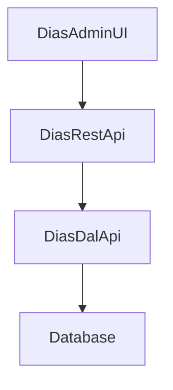

# Master Plan: [Feature Name]

> **Template Purpose**: This template is for creating Master Specs at the Combine Repo level that coordinate changes across multiple child repositories (DiasAdminUI, DiasRestApi, DiasDalApi). Use this template when a feature requires changes in more than one repository.

## Metadata

- **Created**: [YYYY-MM-DD]
- **Status**: [active | in-progress | completed]
- **Affected Repositories**: [List: DiasAdminUI, DiasRestApi, DiasDalApi]
- **Related Specs**: [Links to related Master Specs or Implementation Specs]
- **Owner**: [Team/Person responsible]

## Overview

[Provide a high-level description of the feature or change. Explain why this requires coordination across multiple repositories and what business value it provides.]

## Impact Analysis

### DiasAdminUI Impact

**Changes Required**: [Yes/No]

**Description**: [Describe what changes are needed in the Admin UI]

**Estimated Effort**: [Small/Medium/Large]

**Dependencies**: [List any dependencies on other repos]

### DiasRestApi Impact

**Changes Required**: [Yes/No]

**Description**: [Describe what changes are needed in the REST API Gateway]

**Estimated Effort**: [Small/Medium/Large]

**Dependencies**: [List any dependencies on other repos]

### DiasDalApi Impact

**Changes Required**: [Yes/No]

**Description**: [Describe what changes are needed in the Data Access Layer]

**Estimated Effort**: [Small/Medium/Large]

**Dependencies**: [List any dependencies on other repos]

### Legacy System Impact

**Changes Required**: [Yes/No]

**Description**: [Describe any impact on legacy systems or migration requirements]

**Migration Strategy**: [Describe how to handle legacy compatibility]

## Requirements

[Define the high-level requirements for this feature. Use EARS (Easy Approach to Requirements Syntax) patterns where applicable.]

### Functional Requirements

1. [Requirement 1]
2. [Requirement 2]
3. [Requirement 3]

### Non-Functional Requirements

1. [Performance requirements]
2. [Security requirements]
3. [Scalability requirements]

### Cross-Repository Requirements

1. [Requirements that span multiple repositories]
2. [Integration requirements]
3. [Data consistency requirements]

## Architecture & Design

### High-Level Architecture

[Describe the overall architecture. Include Mermaid diagrams if helpful.]



### Component Interactions

[Describe how components across repositories will interact]

### Data Flow

[Describe how data flows through the system]

### API Contracts

[Define any new or modified API contracts between services]

## Code Quality Standards

### ESLint Compliance Across Repositories

All implementation work must follow strict ESLint standards:

**Universal Standards:**
- ✅ **Zero ESLint Errors**: All repositories must pass linting before merge
- ✅ **Explicit Return Types**: All functions must have return type annotations
- ✅ **Absolute Imports**: Use path mappings instead of relative imports
- ✅ **Function Length**: Maximum 200 lines per function
- ✅ **Type Safety**: 0% `any` usage target across all repositories

**Repository-Specific Considerations:**

**DiasAdminUI (React/TypeScript):**
```typescript
// ✅ CORRECT: Component with proper typing
import { FC } from 'react';
import { UserService } from '@services/user.service';

interface UserProfileProps {
  userId: string;
  onUpdate?: (user: User) => void;
}

export const UserProfile: FC<UserProfileProps> = ({ userId, onUpdate }) => {
  // Component implementation
};
```

**DiasRestApi (Node.js/LoopBack):**
```typescript
// ✅ CORRECT: Controller with proper typing
import { inject } from '@loopback/core';
import { Request, Response } from 'express';
import { LoggingService } from '@core/logging/logging.service';

export class UserController {
  constructor(
    @inject('services.LoggingService')
    private readonly loggingService: LoggingService,
  ) {}

  async getUser(request: Request, response: Response): Promise<void> {
    const userId = request.params.id;
    const user = await this.userService.getById(userId);
    response.json(user ?? null);
  }
}
```

**DiasDalApi (Data Layer):**
```typescript
// ✅ CORRECT: Repository with proper typing
import { Repository } from 'typeorm';
import { User } from '@entities/user.entity';

export class UserRepository {
  constructor(
    private readonly repository: Repository<User>,
  ) {}

  async findById(id: string): Promise<User | null> {
    return await this.repository.findOne({ where: { id } }) ?? null;
  }
}
```

## Implementation Strategy

### Phase 1: [Phase Name]

**Repositories**: [Which repos are involved]

**Tasks**:
1. [Task 1]
2. [Task 2]

**Dependencies**: [What must be completed first]

### Phase 2: [Phase Name]

**Repositories**: [Which repos are involved]

**Tasks**:
1. [Task 1]
2. [Task 2]

**Dependencies**: [What must be completed first]

### Phase 3: [Phase Name]

**Repositories**: [Which repos are involved]

**Tasks**:
1. [Task 1]
2. [Task 2]

**Dependencies**: [What must be completed first]

## Orchestration Tasks

> **Note**: Each orchestration task should reference specific Implementation Specs in child repositories. Create Implementation Specs using the `templates/implementation-task.md` template.

### Task 1: [Task Name]

**Repository**: [DiasAdminUI | DiasRestApi | DiasDalApi]

**Implementation Spec**: [Link to `.kiro/specs/{feature-name}/` in child repo]

**Description**: [What needs to be implemented]

**Dependencies**: [Other tasks that must complete first]

**Status**: [not-started | in-progress | completed]

### Task 2: [Task Name]

**Repository**: [DiasAdminUI | DiasRestApi | DiasDalApi]

**Implementation Spec**: [Link to `.kiro/specs/{feature-name}/` in child repo]

**Description**: [What needs to be implemented]

**Dependencies**: [Other tasks that must complete first]

**Status**: [not-started | in-progress | completed]

### Task 3: [Task Name]

**Repository**: [DiasAdminUI | DiasRestApi | DiasDalApi]

**Implementation Spec**: [Link to `.kiro/specs/{feature-name}/` in child repo]

**Description**: [What needs to be implemented]

**Dependencies**: [Other tasks that must complete first]

**Status**: [not-started | in-progress | completed]

## Documentation Updates

> **Documentation Protocol**: All changes must follow the Documentation Protocol defined in `docs/meta/maintaining-docs.md`. Documentation must be updated as part of implementation, not after.

### Combine Repo Documentation

**Files to Update**:
- [ ] `docs/architecture/[file].md` - [Describe changes]
- [ ] `docs/integration/[file].md` - [Describe changes]
- [ ] `docs/README.md` - [Describe changes]

**New Files to Create**:
- [ ] `docs/[category]/[new-file].md` - [Describe purpose]

**Architecture Diagrams to Update**:
- [ ] [Diagram name] - [Describe changes]

### Child Repo Documentation

**DiasAdminUI**:
- [ ] `DiasAdminUI/docs/[category]/[file].md` - [Describe changes]

**DiasRestApi**:
- [ ] `DiasRestApi/docs/[category]/[file].md` - [Describe changes]

**DiasDalApi**:
- [ ] `DiasDalApi/docs/[category]/[file].md` - [Describe changes]

## Testing Strategy

> **Testing Philosophy**: Focus on core functional tests during development for fast feedback. Optional tests (property-based, performance, extended integration) provide comprehensive coverage but should be run selectively.

### Test Categorization

**Core Tests** (Run during active development):
- Unit tests for business logic
- Acceptance tests for API contracts
- Basic integration tests for critical paths
- Target: < 2 minutes execution time per repository

**Optional Tests** (Run before merge/deployment):
- Property-based tests (PBT) for edge cases
- Performance tests with environment-specific thresholds
- Extended integration tests
- Cross-repository integration tests
- Load and stress tests

### Cross-Repository Testing Coordination

**Integration Test Strategy**:
- Define clear API contracts between services
- Test contract compliance in each repository independently
- Create end-to-end tests that span multiple repositories
- Use test doubles/mocks for external dependencies during development
- Run full integration suite before deployment

**Test Execution Order**:
1. **Phase 1**: Unit tests in each repository (parallel)
2. **Phase 2**: Integration tests within each repository (parallel)
3. **Phase 3**: Cross-repository integration tests (sequential)
4. **Phase 4**: End-to-end tests (sequential)

### Property-Based Testing Configuration

For repositories using property-based tests (fast-check):

**Development Mode** (Fast feedback):
```bash
# Run with minimal iterations for quick validation
PBT_VERBOSE=0 PBT_RUNS=10 npm test
```

**Pre-Merge Mode** (Thorough validation):
```bash
# Run with full iterations and verbose output
PBT_VERBOSE=2 PBT_RUNS=100 npm test
```

**Configuration Guidelines**:
- Default to `PBT_RUNS=10` during active development
- Use `PBT_RUNS=100` or higher before merging
- Set `PBT_VERBOSE=0` to suppress detailed output during development
- Set `PBT_VERBOSE=2` when debugging PBT failures

### Performance Testing Strategy

**Environment-Specific Thresholds**:
- **CI Environment**: Relaxed thresholds (2-3x local)
- **Local Development**: Strict thresholds for fast feedback
- **Production Monitoring**: Real-world performance baselines

**Performance Test Categorization**:
- Mark performance tests as **optional** by default
- Run performance tests before major releases
- Track performance trends over time
- Alert on significant regressions

**Example Threshold Configuration**:
```typescript
const thresholds = {
  local: { maxDuration: 100, maxMemory: 50 },
  ci: { maxDuration: 300, maxMemory: 150 }
};
```

### Integration Testing

**Repository-Level Integration**:
- Test interactions between components within each repository
- Validate database operations and data consistency
- Test external service integrations with appropriate test doubles

**Cross-Repository Integration**:
- Test API contracts between DiasRestApi and DiasDalApi
- Test data flow from DiasAdminUI through DiasRestApi to DiasDalApi
- Validate authentication and authorization across services
- Test error handling and propagation between services

**Integration Test Environment**:
- Use dedicated test databases
- Configure test-specific environment variables
- Ensure proper cleanup between test runs
- Document required test data setup

### End-to-End Testing

**E2E Test Scenarios**:
1. [Critical user journey 1]
2. [Critical user journey 2]
3. [Critical error handling scenario]

**E2E Test Execution**:
- Run against deployed test environment
- Validate complete workflows across all repositories
- Test real authentication and authorization flows
- Verify data persistence and consistency

### Test Execution Commands

**Per Repository**:
```bash
# Core tests only (fast feedback during development)
npm run test:core

# All tests including optional
npm test

# Property-based tests with custom configuration
PBT_VERBOSE=0 PBT_RUNS=10 npm run test:core

# Performance tests only
npm run test:performance
```

**Cross-Repository**:
```bash
# Run all core tests across repositories
npm run test:all:core

# Run full test suite across repositories
npm run test:all

# Run integration tests only
npm run test:integration
```

### Testing Checklist

**During Development**:
- [ ] Core unit tests passing in all affected repositories
- [ ] Core acceptance tests passing for new/modified APIs
- [ ] Basic integration tests passing

**Before Merge**:
- [ ] All core tests passing
- [ ] Property-based tests passing with PBT_RUNS=100
- [ ] Performance tests passing (if applicable)
- [ ] Cross-repository integration tests passing
- [ ] No test coverage regressions

**Before Deployment**:
- [ ] Full test suite passing in all repositories
- [ ] End-to-end tests passing
- [ ] Performance benchmarks within acceptable ranges
- [ ] Load tests passing (if applicable)
- [ ] Rollback procedures tested

## Rollout Plan

### Pre-Deployment Checklist

- [ ] All Implementation Specs completed
- [ ] All tests passing
- [ ] Documentation updated
- [ ] Architecture diagrams updated
- [ ] API documentation updated
- [ ] Migration scripts tested (if applicable)

### Deployment Order

1. [First repository to deploy]
2. [Second repository to deploy]
3. [Third repository to deploy]

### Rollback Plan

[Describe how to rollback if issues are discovered]

## Risk Assessment

### Technical Risks

| Risk | Impact | Probability | Mitigation |
|------|--------|-------------|------------|
| [Risk 1] | [High/Medium/Low] | [High/Medium/Low] | [Mitigation strategy] |
| [Risk 2] | [High/Medium/Low] | [High/Medium/Low] | [Mitigation strategy] |

### Integration Risks

| Risk | Impact | Probability | Mitigation |
|------|--------|-------------|------------|
| [Risk 1] | [High/Medium/Low] | [High/Medium/Low] | [Mitigation strategy] |
| [Risk 2] | [High/Medium/Low] | [High/Medium/Low] | [Mitigation strategy] |

## Success Criteria

- [ ] [Criterion 1]
- [ ] [Criterion 2]
- [ ] [Criterion 3]
- [ ] All documentation updated per Documentation Protocol
- [ ] All Implementation Specs archived in completed/

## Spec History & Archival

### Completion Checklist

When this Master Spec is completed:

- [ ] Update status to "completed"
- [ ] Update completion date in metadata
- [ ] Move to `.kiro/specs/completed/{feature-name}/`
- [ ] Create `metadata.json` with completion details
- [ ] Verify all linked Implementation Specs are also completed
- [ ] Update spec history log
- [ ] Verify all documentation updates are complete

### Related Specifications

**Master Specs**:
- [Link to related Master Spec 1]
- [Link to related Master Spec 2]

**Implementation Specs**:
- [DiasAdminUI/.kiro/specs/{feature-name}/](link)
- [DiasRestApi/.kiro/specs/{feature-name}/](link)
- [DiasDalApi/.kiro/specs/{feature-name}/](link)

## Notes

[Any additional notes, considerations, or context that doesn't fit in other sections]

---

## Template Usage Instructions

1. **Copy this template** to `.kiro/specs/{feature-name}/master-plan.md`
2. **Fill in all sections** with specific details for your feature
3. **Create Implementation Specs** in each affected child repository using `templates/implementation-task.md`
4. **Link Implementation Specs** in the Orchestration Tasks section
5. **Update documentation** as you implement (not after)
6. **Track progress** by updating task statuses
7. **Archive when complete** by moving to `.kiro/specs/completed/{feature-name}/`

## Documentation Protocol Compliance

This template enforces the Documentation Protocol by:

- ✅ Requiring documentation updates as part of the implementation plan
- ✅ Requiring architecture diagram updates when components change
- ✅ Requiring API documentation updates when contracts change
- ✅ Prohibiting deletion of completed specs (archive instead)
- ✅ Maintaining traceability between Master Specs and Implementation Specs
- ✅ Requiring spec history tracking

**Before starting implementation**: Read `docs/meta/maintaining-docs.md`

**During implementation**: Update documentation alongside code changes

**After completion**: Archive this spec (never delete)
